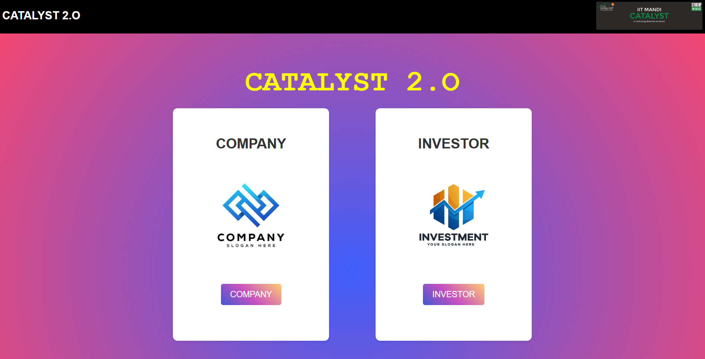

# CATALYST-2.O
### **1.Problem Statement-**
So often do small startups and ventures crumble at very early stages due to lack of accessibility to funds. There is no easy way by which they can turn their brainstorming ideas into practical products. They need a simple online platform where they can not only tell their ideas to the world, but also raise funds from investors. Investors, on the other hand, need a trustable platform where they can perform transactions easily and have a trust factor in the company they are investing their money in.

### **2.Proposed Solution-**

Here comes **CATALYST 2.O**, an online platform where great ideas meet their path ahead. Here, the user can choose either of 2 profiles- 1. The Company/Startup; 2. The investor. We have built a platform where they can come together and companies can raise funds based on certain terms and investors can invest in the domains they might be interested in.

### **3. Key Features-**
**(i) SMART CONTRACT:** 
The smart contract we developed has implemented the following 2 actions- 

(a) We keep a check on how much of the company's target funding has been received till date. Once the target amount is reached, our smart contract detects it and displays the appropriate message to the company.

(b) For a better user experience, we also give the company a chance to **withdraw any time** from the funding round in case it feels it could not get the required funding within the time constraint. Our code also ensures that the **investor's money is automatically credited back to the investor's account**, and the investor can also see the same on his dashboard. The company will be de-registered from the website.

**(ii) SAFE AND SECURE TRANSACTIONS:** The use of blockchain technology ensures that transactions are safe, and no details of the transaction are shared to the host platform or any 3rd party.

### **4. The Implementation-**
**(i) JAVASCRIPT AND NODE JS:** Once the user has registered (as either of company/investor), we send the data from our basic html form to the backend, built in javascript and node js. Here, we interact with Ganache to implement the transactions and the smart contract conditions mentioned.

**(ii) MYSQL:** We store the details entered by the user (ex- name, email, funding required, etc) in MYSQL using 2 separate tables for company and investor.

**(iii) web3.js + GANACHE:** We have used **web3.js**, a JavaScript library that provides a way for developers to interact with the **Ethereum blockchain** using JavaScript code. We set up a local ethereum blockchain using **Ganache**, a local blockchain development tool specifically designed for Ethereum. It provides a personal Ethereum blockchain that we can run on our local machine for testing and development purposes. It allows us to **connect to an Ethereum node, send transactions, and interact with smart contracts** from within a JavaScript environment, typically in a web browser.

We set up different GANACHE profiles for different investors and companies. The investor, in its dashboard can click on INVEST button to invest in the compay it chooses. When it invests some money, **that money(in ethers) is actually reduced from the Ganache ID of the investor and credited to the Ganache ID of the company.** This interaction with GANACHE is established by web3.js. All the relevant details are shown on the company's as well as investor's dashboard. SImilarly, in case the company withdraws, the money is reduced from the Ganache ID of the company and credited back to the Ganache ID of the investor. **Thus, we have achieved real and safe transactions.**

**(iv) HTML/CSS**: A friendly and attractive user interface has been built using HTML and CSS styling.

### **5. The Dashboards-**
**(i) INVESTOR DASHBOARD:** Here, the investor can see all companies and invest in the company of his choice. The details of the company, including its investment pitch and funding required can be seen here. Also we have implemented **a functionality by which he can see that how much money has been credited back to his account in case the company withdraws.**

**(ii) COMPANY DASHBOARD:** Here, the startup company can see how much of its funding amount it has received, and can withdraw if needed (as mentioned earlier). We also give it an appropriate message here once the funding goal is received.

### **6. Future Scope-**
In future, we can charge some registration fee from the companies who want raise funds through our platform and can start a subscription model (on monthly basis) in which they will get some added benefits such as social media marketing from our end.

Apart from the investor and company model we can also bring NGOs to our platform from where they can generate crowd funding by Blockchain technology.

